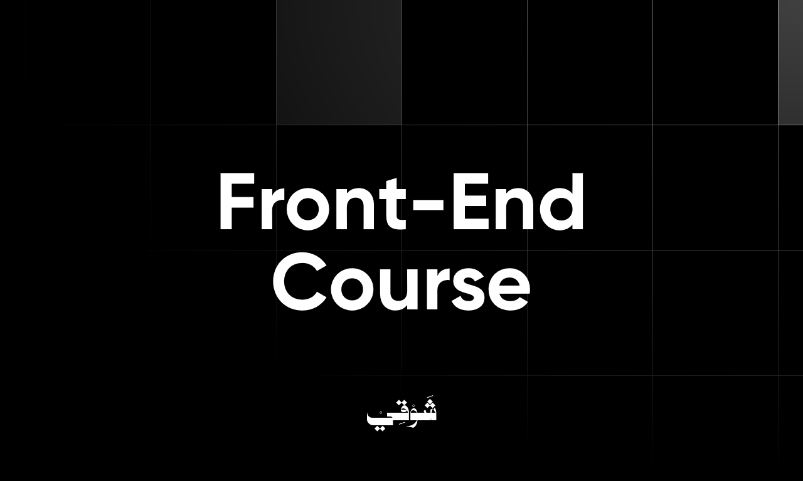

<!-- DONE REVIEWING: GITHUB COMMIT -->

# Front-End Web Development Course

## Introduction

AsSalam Alaikum, a brave people who want to learn Front-End Web Development 💪🏻 I am Shawqi Hatem, your instructor in this course. I am twenty-one years old and have years of experience in Front-End development. I am currently working with [MikaByte](https://mikabyte.com/) company and am so excited to guide you on your journey of leading Front-End Development.

## Outline

1. _What are we going to learn in this course?_
2. _What are the objectives of this course?_
3. _For who is this course?_
4. _Notes and advice from Shawqi._
5. _Lectures notes._

## What are we going to learn in this course?

This course is split into two parts, **_60_** hours each.

First, we are going to learn front-end development from scratch. We will start by giving a brief introduction to how the web works. Then, we will begin with HTML and CSS basics and move on to intermediate and advanced CSS concepts. Learning the previous concepts will take **_~22_** hours, and we will start learning JavaScript afterward!

We will start with the basics of JavaScript, then move on to ES6 and DOM Manipulation, and finish with OOP, Functional Programming, and Promises. Learning this will take **_~26_** hours, and then we can peacefully land on building a project using what we have learned in HTML, CSS, and JavaScript in **_~12_** hours 🌐.

Second, we will learn one of the best (or maybe the best) JavaScript frameworks: React.JS ⚛️!

We will start by giving another brief introduction to JavaScript frameworks, what they are, why we need them, and the difference between a library and a framework. Then, we will create a simple React.JS application (by converting a JavaScript clock application into a React.JS application). We will then move on to learn React.JS JSX elements and components, functional and class components, props and state management, events handling, conditional rendering, React.JS hooks, fetching data from APIs in React.JS, routing, forms, and building forms using the `react-hook-form` library. Learning these concepts will take **_~36_** hours, and we will create a project while learning them.

Afterward, in **_~9_** hours, we will learn advanced React.JS concepts, such as the Context API for state management, error handling, React.JS performance optimization techniques, lazy loading, code splitting, and React testing libraries.

Finally, we will build and DEPLOY a super secret React.JS project in **_~9_** hours!

## What are the objectives of this course?

1. We are giving you a clear roadmap built by an actual front-end developer and wealthy with external learning and developing resources.
2. We are building a solid foundation of understanding HTML, CSS, JavaScript, and React.JS framework, including building projects that you can use as a reference or for your work showcase.
3. We are preparing you to either advance your skills by learning any new skill related to front-end development or start building front-end development projects for real clients.

## For who is this course?

In front-end development and every other development or programming field, there are theoretical and practical parts. You will master some concepts by learning their theoretical parts and how they work behind the scenes, and you will master other concepts by practicing them over and over again. However, you can not split between both of these two parts. You will only see improvement if you study something theoretically while practicing it or vice versa! Also, some experienced developers/instructors say that you must focus on the theoretical stuff if you want to teach it and focus on the practical part if you are going to build projects with it, even though this does not permit you to split between both, because as we have said you will not see progress or improvements!

This course will focus on building developers and practicing writing code as much as possible. We will focus on something other than building academic people :). However, we will theoretically and practically explain some concepts that require theoretical understanding, such as Promises in JavaScript.

**_So, if you want to be an academic, I am sorry, this course is not for you :(_**

## Notes and advice from Shawqi

1. Web development is one of the easiest developing or programming fields to start with and one of the hardest fields to stick with because of the number of options we have for building websites or web applications. We have React.JS, Vue.JS, Angular.JS, and many, many options. But we are not saying this to make you feel depressed. We are saying this to tell you that you must trust the process. You will feel bored while learning HTML, confused while learning CSS, and giving up while learning JavaScript, but this is normal; at some point, you will look behind and feel proud of yourself for your progress!
2. As a follow-up to the previous point, learning is dynamic, not linear. Refrain from expecting that you will understand everything that you will be learning. While learning new things, you will start having a clearer picture of previous things, so as we move in the course, things will begin triggering in your brain, and you will start connecting new things to previous things and vice versa.
3. We will start slowly in the course, but we will be making good progress together, so again, please trust the process and give yourself the chance.
4. Finally, we will have many additional sessions (not counted in the course total hours) to practice what we have learned and learn new skills together, such as Tailwind CSS, other UI libraries, Next.JS, Git, GitHub, and many more.

I wish you all luck, Shawqi.
