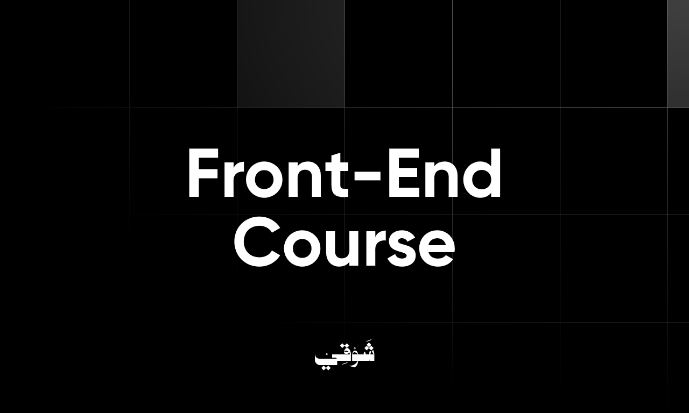

<!-- DONE REVIEWING: GITHUB COMMIT -->

# Lecture 01: Introduction and HTML Basics

## Outline

1. Introduction.
2. HTML Headings/Paragraphs.
3. HTML Attributes and Anchor Links.
4. HTML Images.
5. HTML Lists
6. Practice.

## Introduction

Web developers build websites for clients who want to showcase themselves, their services, or products on the web.

**_Web developers are categorized into three main categories_**:

1. Front-End Developers.
2. Back-End Developers.
3. Full-Stack Developers.

### Front-End Developers

They are responsible for everything the user sees on the website, starting with implementing a website design (i.g. a Figma design) into the actual website, including the presentation of the content and the user interface elements, such as the navigation bar, text, images, buttons, etc.

In modern web development, front-end developers are also responsible for dynamically rendering the website's content by fetching data from APIs and generating the website's content based on the fetched data. (Social Media Example).

Finally, front-end developers mainly use HTML, CSS, JavaScript, and their relevant frameworks to build effective websites with excellent user experiences.

### Back-End Developers

They are responsible for building the web servers and ensuring the data is stored in a database, processed (i.g., authentication, authorization), and delivered to the front-end developers through APIs or other alternatives. Hence, they have what they need to generate the right website content.

This process was more complicated in the past, and developers do not use only one methodology for building websites today in web development. However, we will keep it like this until we explain it in one of the theoretical sessions.

### Full-Stack Developers

They are comfortable doing both :)

### How to start building websites and HTML Basics

Computers are stupid! They do not understand human language. You must tell them this is a `.png` file to realize that this image must open in an image viewer software. You must tell them this is a `.docx` file to recognize that this is a Word or any other content-editable document that must open in a text editor software. We inform computers by making files with specific extensions that align with our needs.

**_You do not need to be brilliant to guess that it is the same with websites!_**

We must tell them that this file is a website that must be opened in a browser. To do this, we must create a file with the `.html` extension.

#### Why the `.html` extension?

Because browsers only understand HTML, CSS, and JavaScript. All these three languages work together to make us a fancy website.

HTML is the markup language or the raw data that a website page is built from. It creates all the text, images, links, lists, buttons, and forms.

CSS is the styling language that adds style to these HTML elements. It controls fonts, colors, backgrounds, widths, heights, and layouts.

JavaScript is the programming language that adds interactivity to our website.

In short, HTML puts information on a website page, CSS positions that information by adding styles, and JavaScript adds interactivity for the user with the information.

**_HTML is the (noun), CSS is the (adjective), and JavaScript is the (verb) :)_**

So, let us start by building our first HTML page!

Whenever we want to start a new website project, we should create a folder on our local machine (our computer) and then make an `index.html` file. You can name it whatever you want, but you must follow the name with the `.html`

You can create a file using Windows Explorer in Windows or Finder on MacOS and then double-click on it, and your computer will open it in the browser, showing only a blank page. Then, you can open the file with NotePad in Windows or TextEdit in MacOS or other text editors and start editing your page. However, we will use VSC (Visual Studio Code) to create and edit it, and VSC will be our main code editor.

Go and create a folder somewhere on your desktop, then open VSC. Go to the file menu at the top. Choose the open folder option and open the folder you have just created.

After opening your folder, you will see its name on the left sidebar. When you hover over the folder's name, four icons will appear. The icon that looks like a file with the plus symbol on top of it is the one for creating a new file. Click on it to create a new file, name it `index.html`, and let us go.

## HTML Syntax

HTML, the language that underpins our website's content, is responsible for structuring text, links, lists, images, inputs, buttons, and more. To populate our website with such content, we must employ HTML elements, which require HTML tags and their syntax.

We have a blog article web page and want to add a main heading. We need to use an HTML element/tag called `h1`. The same applies if we need to add a paragraph. We need to use the `p` HTML element/tag.

HTML elements/tags have a simple syntax or structure that consists of four main parts.

1. Opening tag: `<opening-tag>`
2. Attributes (Optional): `<opening-tag attribute-name="attribute-value">`
3. Closing tag: `</closing-tag>`
4. Tag Content: `<opening-tag>Tag Content</closing-tag>`

So, if we want to add a central heading to our blog article web page, it will look like this:

```html
<h1>Let us Learn Front-End Development</h1>
```

Notice that we did not use any attributes in the tag because we do not need any for now, but we will learn and use them soon.

## HTML Headings/Paragraphs

We have a 6-level of headings in HTML from one to six. The most crucial heading (the main heading) is always `h1` tags, and the sub-headings after it are `h2`, `h3`, `h4`, `h5`, and `h6`.

Remember, for better SEO, you must always have just one `h1` on your web page, but you can have multiple from the other heading levels.

Example:

```html
<h1>Why React.JS Is The Best JavaScript Framework/Library</h1>
```

We use the `p` element/tag for paragraphs. So clear and straightforward.

Example:

```html
<p>This is a paragraph</p>
```

## HTML Anchor Links and Attributes

For links in HTML, we use the `a` element/tag, which refers to the anchor link, but if you use the tag like the previous tags like this:

```html
<a>https://github.com/shawqicauses</a>
```

It will just show a non-clickable link on the page, which differs from what we want. We need to add a text that says, "Click here to visit my GitHub profile." When we click it, it sends us to my profile on GitHub. To do so, we must use a specific attribute to hold the link called `href`, which refers to Hyper Reference, and then we put the text in the content between the opening and closing tags.

Example:

```html
<a href="https://github.com/shawqicauses">
  Click here to visit my GitHub profile.
</a>
```

Congratulations, you just have written your first HTML tag with an HTML attribute.

## HTML Images

To add images to your web page, first download an image and put it in the same folder as your `.html` file. Second, we will use a new HTML tag and two attributes, the `img` tag, `src` and `alt` attributes.

The `src` attribute is where we will add the path to the image. The `alt` attribute is where we will add text and has two main jobs. First, it will appear if, in some cases, the image can not load and show on the web page. Second, it will help improve our web page accessibility by giving the screen readers a text they can read for people who can not see the image.

Example: let us say that you have created a folder called images, and you put your image there.

```html

```

Have you noticed something? We did not close our `img` tag. Why? The `img` tag is self-closing. It does not accept content, so we do not need a closing tag.

## HTML Lists

We have three types of lists in HTML, but we will talk about two of them for now: the ordered list and the unordered list. To add a list in HTML, you must first decide which type of lists you want to use their elements/tags, `ol` for the ordered list and `ul` for the unordered list. Afterward, you must add your list items using the `li` element.

Example for ordered list:

```html
<ol>
  <li>First Item</li>
  <li>Second Item</li>
  <li>Third Item</li>
</ol>
```

Example for unordered list:

```html
<ul>
  <li>HTML</li>
  <li>CSS</li>
  <li>JavaScript</li>
  <li></li>
</ul>
```
